# 🧪 Laravel Docker CI Workflow

This GitHub Actions workflow is designed to **test a Laravel application inside Docker containers**.  
It performs automated **database migrations**, **PHPUnit tests**, and sends **Slack notifications** for success and failure events.

---

## 📘 Workflow Overview

**Workflow file:** `.github/workflows/test-laravel-docker.yml`  
**Triggers:**  
- On every push to `main` or `develop`  
- On every pull request to `main` or `develop`

---

## ⚙️ Step-by-Step Process

### 1️⃣ 🧩 Checkout Repository
Fetches the latest version of your code from GitHub using the `actions/checkout@v3` action.  
This ensures your workflow always uses the latest commit.

---

### 2️⃣ 🐳 Build Laravel Docker Image
Builds your Laravel application image from the `docker/Dockerfile`.  
This image includes PHP, Composer, and all Laravel dependencies needed to run migrations and tests.

---

### 3️⃣ 🗄️ Start and Wait for MySQL
Starts a **MySQL 8.0** container as a service.  
The workflow waits until the MySQL instance is reachable on port `3306` before proceeding.

---

### 4️⃣ ⚙️ Run Laravel Migrations
Runs `php artisan migrate --force` inside the Docker container to create or update the database schema before tests are executed.

---

### 5️⃣ 🧪 Execute PHPUnit Tests
Runs Laravel’s **PHPUnit test suite** to verify that all code changes pass existing tests.  
If tests fail, it automatically triggers a Slack “Failure” notification.

---

### 6️⃣ ✅ Slack Notification (Success)
When all tests pass, the workflow sends a **green success message** to a configured Slack channel.  
This keeps your team instantly informed of successful builds.

---

### 7️⃣ ❌ Slack Notification (Failure)
If any stage fails (migrations, build, or tests), a **red failure message** is sent to Slack with details like:
- Repository name  
- Branch  
- Commit SHA  

---

## 🧩 Required GitHub Secrets

To make Slack integration work, you must set the following secrets in your repository:

| Secret Name | Description |
|--------------|-------------|
| `SLACK_WEBHOOK_URL` | Your Slack Incoming Webhook URL |
| `SLACK_WEBHOOK_TYPE` | Set this to `INCOMING_WEBHOOK` |

---

## 🗂️ Recommended Project Structure

```
├── .github/
│ └── workflows/
│ └── test-laravel-docker.yml
├── docker/
│ └── Dockerfile
├── app/
├── database/
├── vendor/
└── composer.json
```

---

## 📈 Mermaid Diagram — Workflow Visualization

```mermaid
flowchart TD;
    A[🧩 Push or PR to main/develop] --> B[⚙️ Start GitHub Actions Job]
    B --> C[🧩 Checkout Repository]
    C --> D[🐳 Build Laravel Docker Image]
    D --> E[🗄️ Start MySQL Service]
    E --> F[⏳ Wait for MySQL Ready]
    F --> G[⚙️ Run Laravel Migrations]
    G --> H[🧪 Run PHPUnit Tests]
    H --> I{✅ Tests Passed?}
    I -->|Yes| J[📣 Send Slack Success Notification]
    I -->|No| K[🚨 Send Slack Failure Notification]
    J --> L[🏁 Workflow Completed]
    K --> L
```


